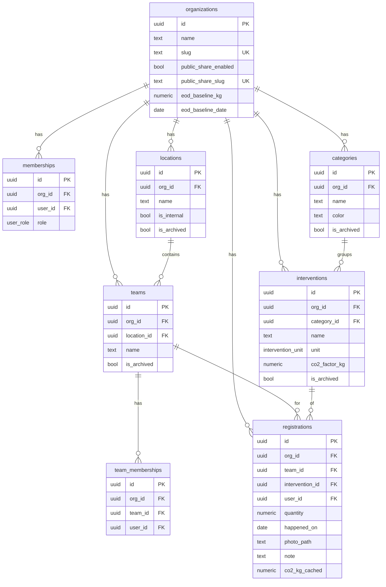

# Database

Update dit document bij **elke migratie** (iedere nieuwe file in `supabase/sql/`).

## SQL-files (bron van waarheid)

| File | Doel |
| --- | --- |
| `supabase/sql/0001_init.sql` | Tabellen, enums, helper-functies, RLS, storage bucket `registrations` |
| `supabase/sql/0002_views.sql` | Publieke aggregate-views (security_invoker) voor share-links |
| `supabase/sql/0003_platform_admins.sql` | Platform-brede superadminrol + read-only cross-tenant RLS-uitbreiding |
| `supabase/sql/9000_seed.sql` | Dev-seed: LEV Groep + 9 locaties + 4 teams Helmond + 6 cat + 10 interventies |

## Schema (export)

### Enums
- `public.user_role`: `admin` | `worker`
- `public.intervention_unit`: `kg`, `km`, `maaltijd`, `kwh`, `stuk`, `uur`, `liter`, `dag`

### Tabellen

- **organizations** (`id` pk, `name`, `slug` uniek, `public_share_enabled`, `public_share_slug` uniek, `eod_baseline_kg`, `eod_baseline_date`, timestamps)
- **platform_admins** (`user_id` pk/fk -> `auth.users`, `created_at`; platform-brede superadminrol)
- **memberships** (`id` pk, `org_id` fk, `user_id` fk -> `auth.users`, `role`, `created_at`; uniek op `(org_id, user_id)`)
- **locations** (`id` pk, `org_id` fk, `name`, `is_internal`, `is_archived`, timestamps; uniek op `(org_id, name)`)
- **teams** (`id` pk, `org_id` fk, `location_id` fk, `name`, `is_archived`, timestamps; uniek op `(org_id, location_id, name)` en `(org_id, id)` voor composite FK)
- **team_memberships** (`id` pk, `org_id` fk, `team_id` fk, `user_id` fk, `created_at`; uniek op `(team_id, user_id)`)
- **categories** (`id` pk, `org_id` fk, `name`, `color` `#RRGGBB`, `is_archived`, timestamps; uniek op `(org_id, name)`)
- **interventions** (`id` pk, `org_id` fk, `category_id` fk via `(org_id, category_id) -> categories(org_id, id)`, `name`, `unit`, `co2_factor_kg`, `is_archived`, timestamps; uniek op `(org_id, name)`)
- **registrations** (`id` pk, `org_id` fk, `team_id` + `intervention_id` als composite FKs naar `(org_id, *)`, `user_id` fk, `quantity > 0`, `happened_on`, `photo_path`, `note`, `co2_kg_cached`, timestamps)

Waarom composite FKs op `registrations`: ze garanderen dat team en intervention uit dezelfde org komen als `registrations.org_id`, zonder cross-tenant leak.

Waarom `co2_kg_cached`: snapshot van `quantity * interventions.co2_factor_kg` op insertmoment, zodat factor-wijzigingen historische dashboards niet verschuiven.

## ERD (Mermaid)

## RLS / Policies (samenvatting)

Rollen:
- `anon` — niet ingelogd. Leest alleen publieke views en aggregaat-kolommen van rijen van organisaties met `public_share_enabled = true`.
- `authenticated` — ingelogd. Alles via `memberships`. Twee subrollen conceptueel: `worker` en `admin` (per org, via `memberships.role`).
- `superadmin` — platformbreed via `platform_admins`, read-only over alle tenantdata heen.

Helper-functies (`security definer`, bypassen RLS op `memberships` om recursie te voorkomen):

- `app_is_member(org_id)` — `memberships.user_id = auth.uid()`
- `app_is_admin(org_id)` — `memberships.user_id = auth.uid() and role = 'admin'`
- `app_is_in_team(team_id)` — `team_memberships.user_id = auth.uid()`
- `app_is_superadmin()` — `platform_admins.user_id = auth.uid()`

| Tabel | SELECT | INSERT | UPDATE | DELETE |
| --- | --- | --- | --- | --- |
| `organizations` | member or superadmin (auth), `public_share_enabled=true` (anon) | - (via service-role) | admin | - (via service-role) |
| `platform_admins` | superadmin | superadmin | superadmin | superadmin |
| `memberships` | self, admin of superadmin | admin | admin | admin |
| `locations` | member or superadmin; anon als org publiek | admin | admin | admin |
| `teams` | member or superadmin; anon als org publiek | admin | admin | admin |
| `team_memberships` | member or superadmin | admin | admin | admin |
| `categories` | member or superadmin; anon als org publiek | admin | admin | admin |
| `interventions` | member or superadmin; anon als org publiek | admin | admin | admin |
| `registrations` | member or superadmin; anon (aggregate-kolommen) als org publiek | admin OR (member+team-lid+self) | owner OR admin | owner OR admin |

Anon-kolombeperking op `registrations`: `revoke select on registrations from anon` + `grant select (id, org_id, team_id, intervention_id, quantity, happened_on, co2_kg_cached, created_at)`. `user_id`, `photo_path` en `note` zijn dus nooit publiek.

Storage `registrations` bucket:
- Path-conventie: `<org_id>/<registration_id>/<filename>`.
- SELECT: member van de org of superadmin (gebaseerd op eerste path-segment).
- INSERT: member van de org.
- UPDATE/DELETE: uploader (`owner = auth.uid()`) of admin van die org.

## Publieke views (0002)

Alle drie met `security_invoker = true`, `grant select to anon, authenticated`:

- `public_dashboard_totals` — per org: `co2_saved_kg`, `registration_count`, `active_user_count` (via `app_public_org_active_user_count`: SECURITY DEFINER, zodat `anon` geen directe SELECT op `registrations.user_id` nodig heeft), `eod_days_gained` (= `min(365, round((co2/baseline)*365, 2))` of `null` als baseline ontbreekt).
- `public_team_breakdown` — per org -> team: co2 + count.
- `public_category_breakdown` — per org -> categorie: co2 + count + kleur.

## Migrations (legacy veld, niet gebruikt)

Dit project gebruikt **geen CLI-migraties**. Alle schema-changes via genummerde files in `supabase/sql/`, handmatig te draaien in Supabase -> SQL Editor -> Run.
